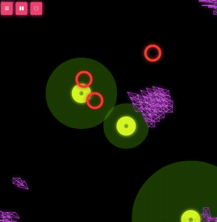

Voids (void-oid objects)
=====

In 1986 Craig Reynolds developed an algorithm to simulate flocking birds by applying simple rules: Keep distance to your neighbors, but tend to the center of surrounding birds and keep the same direction as everyone else. These rules yield a suprisingly convincing flock of birds.

This is an implementation in JavaScript where every rule can be activated or deactivated individually. The cool think about this algorithm is that you can add additional rules as you like, e.g. add predators (pulsing red circles with spikes) which will be avoided or food which will be consumed (pulsing green circles with a constantly growing, green glow which indicates how much food is left and how big the attraction is for nearby voids).

Try it: http://maerch.github.io/static/voids/



## Fork/clone, install & implement your own rules

```
git clone git@github.com:maerch/voids.git

cd voids
npm install
gulp &

cd public
python -m SimpleHTTPServer 8080
```
